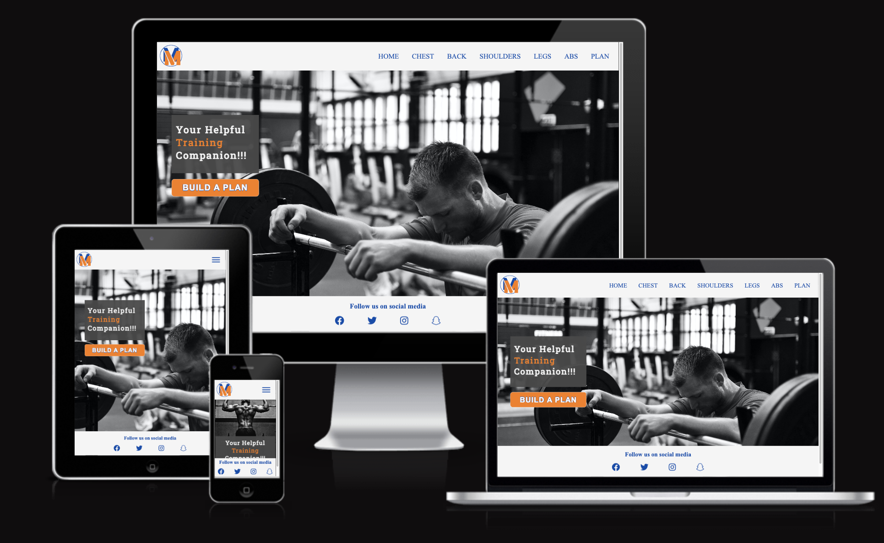
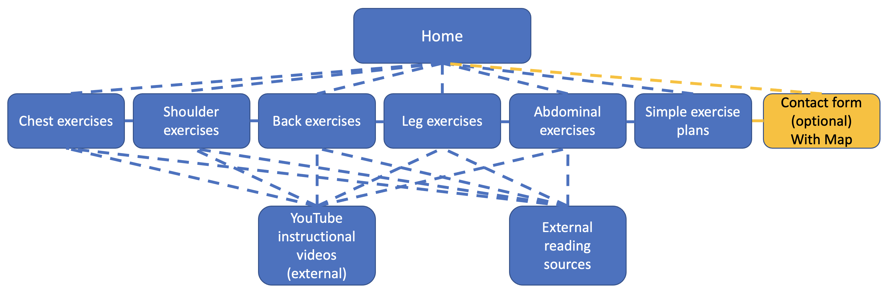
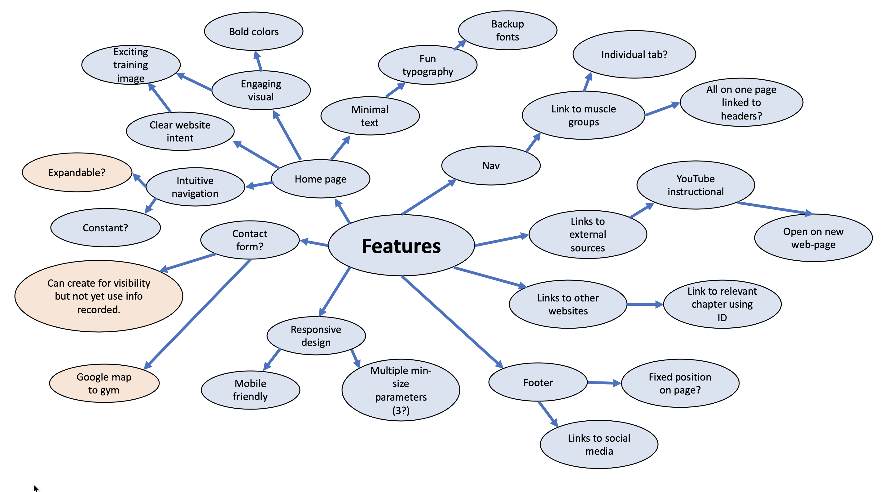

# Muscle Map Website
[View the live project here.](https://joe-collins-1986.github.io/muscle-map/)

(Note: this is a fictious client generated for the purpose of developing this project to test my HTML and CSS essentials)

This website has been designed to provide users with a high-level overview of which exercises can be used use to train specific muscle groups. They will then be able to use these exercises to create a workout plan targeted to their number of available training days.

# Responsive Review

## Responsive review of all website pages:
- [Home](assets/readme-assets/1.responsive/home.png)
- [Chest](assets/readme-assets/1.responsive/chest.png)
- [Back](assets/readme-assets/1.responsive/back.png)
- [Shoulders](assets/readme-assets/1.responsive/shoulders.png)
- [Legs](assets/readme-assets/1.responsive/legs.png)
- [Abs](assets/readme-assets/1.responsive/abs.png)
- [Plan](assets/readme-assets/1.responsive/plan.png)

# User Experience (UX)
## User stories

   #### **Client Goals**
   The client is a personal trainer and gym owner.
   1. Develop brand recognition for his logo and brand colours.
   2. Set up a website to generate traffic which will:
      - some *drive additional gym attendance.* text.
      - provide a contact for his personal training.* text.
   3. Engage with new and first-time gym-goers by providing a simple breakdown of which exercises target each muscle and break. 
   4. Engage with new and first-time gym-goers by providing breaking down the difference between compound exercises and isolation exercises with a link to further reading.
   5. Link exercises to YouTube instruction videos. (This will later be replaced with videos the client will generate personally.
   
   #### **Client Future Goals**
   Wishes which will later be developed to incorporate:
      - Sale of Muscle Map merchandise.
      - Advertisement opportunities.
      - Building a sales platform to connect personal trainers to client’s dependant on specialisation.

   #### **First time visitor goals**
   1. Acknowledge clear and memorable branding.
   2. Understand to purpose of the site.
   3. Simple intuitive navigation.
   4. Easy access to external links provided on the website.
   5. some *Clear contact form and links to social media.* text.
   6. some *Receive gym location.* text.
   7. Gain a basic understanding of the exercises demonstrated and how why they are used.
   8. Clear on all devices.

   #### **Returning Visitor Goals**
   1. Revisit to access instructional links.
   2. Revisit to access social media links.
   3. Revisit to create or update training plan.
   4. Revisit to request personal training after being introduced to the fundamentals.
   5. Revisit to locate gym.

## Design

  #### **Colour scheme**
  Provided by client to match logo.
   - Main colours: 
      - #FA7C07 (Orange)
      - #004AAD (Blue)

   - Colours use to offset text:
      - #F5F5F5 (Off-White)
      - #494949f2 (grey with slight opacity) 

  #### **Typography**
  - Header Titles -'Roboto Slab', serif
  - CTA - Arial, Helvetica, sans-serif
  - Header, Footer, Standard Content -'Times New Roman', Times, serif

  #### **Imagery**
  - Until the client can provide their own pictures the images will be taken from Unsplash. 
  
  These images have been selected to be:
   - Dynamic
   - Pair well with branding colour
   - Appropriate orientation for the space

## Structure Non-Linear Plane

## Wireframes
- [Skeleton Plane](https://www.figma.com/file/QUILIZygurngxMKsDxOrIE/Muscle-Map-(Skeleton)?node-id=5%3A230)

- [Surface Plane](https://www.figma.com/file/M4Emuqqc618HWPX28fgZHk/Muscle-Map-(Surface)?node-id=5%3A182)

NOTE: The structure and wireframes are only to act as a concept and are subject to change as the website development evolves in collaboration with the client.

## Features

# Further development
* Add automation of exercise plan based of information entered by visitor.
* Add E-commerce for sale of muscle map merchandise.

# Technologies Used
## Languages Used
   - HTML
   - CSS
   - JavaScript (taken directly from a YouTube tutorial as I have not yet covered JavaScript - you tube channel referenced in credits section)

## Frameworks, Libraries & Programs Used
1. Google Fonts:
- Used to obtain appropriate fonts to use in website not held as standard.
2. Font Awesome:
- Used to obtain several icons used to improve the visuals of the website.
3. Git:
- Used for version control and to Push to GitHub.
4. GitHub:
- Used to store and share the code as well as publish to live website.
6. Figma:
- Used to plan out website format.
7. Web Developer:
- Used to analyse html and CSS output and correct where required.

# Testing
 ## HTML validator results: 
   - [Home](#)
   - [Chest](#)
   - [Back](#)
   - [Shoulders](#)
   - [Legs](#)
   - [Abs](#)
   - [Plan](#)
 ## CSS validator results
   -[CSS validator results](#)

 ## Lighthouse accessibility results:
   -[Lighthouse accessibility results](#)

## Testing User Stories from User Experience (UX) Section
#### **Client Goals**
   1. Develop brand recognition for his logo and brand colours.
   * **REVIEW - Colours provided by the client used consistently and extensively throughout website.**
   2. Set up a website to generate traffic which will:
      - drive additional gym attendance.
      # * **REVIEW - Provides location of the gym to drive traffic.**
      - provide a contact for his personal training.
      # * **REVIEW - Provides form to contact personal trainer (only managing front end requirements).**
   3. Engage with new and first-time gym-goers by providing a simple breakdown of which exercises target each muscle and break. 
   * **REVIEW - Each muscle slit onto its own page with a clear breakdown of exercises to target it**
   4. Engage with new and first-time gym-goers by providing breaking down the difference between compound exercises and isolation exercises with a link to further reading.
   * **REVIEW - Link to external source explaining the difference. Used external website section ID to direct user to relevant paragraph**
   5. Link exercises to YouTube instruction videos. (This will later be replaced with videos the client will generate personally.
   * **REVIEW - Links to YouTube set up for each exercise. Client specified which YouTuber they wished to reference**

#### **First time visitor goals**
   1. Acknowledge clear and memorable branding.
   * **REVIEW - Muscle Map logo clearly visable in the top left**
   * **REVIEW - Colours provided by the client used consistently and extensively throughout website.**
   2. Understand to purpose of the site.
   * **REVIEW - Hero image gives clear indication this site is dedicated to exercise**
   * **REVIEW - Hero text appears to user instantly and references the website as a training companion**
   3. Simple intuitive navigation.
   * **REVIEW - Clear navigation bar at the top of tha page**
   * **REVIEW - Navigation bar reduces to hamburger icon for smaller screens to ensure information is presented clearly** 
   * **REVIEW - Logo at the top left corner always redirects the user back to the home page.**
   4. Easy access to external links provided on the website.
   * **REVIEW - External links open on a click and open a seperate page**
   * **REVIEW - Each link has an aria-label to detail what the link is and that it will open in a seperate tab**
   5. Clear contact form and links to social media.
   * **REVIEW - Social media links clearly detailed in the footer, which is set to a fixed position to always be visalble**
   # * **REVIEW - Contact Form located on it's own page with clear lableing of inputs**
   6. Receive gym location.
   # * **REVIEW - Location provided in the form of Google maps at the bottom of the contact page**
   7. Gain a basic understanding of the exercises demonstrated and how why they are used.
   * **REVIEW - Each exercise detailed has an accompanying tutorial video to detail correct form and exercise benift**
   8. Clear on all devices.
   * **REVIEW - Media queries used to ensure each page is responsive to all devices**

#### **Returning Visitor Goals**
   1. Revisit to access instructional links.
   2. Revisit to access social media links.
   3. Revisit to create or update training plan.
   4. Revisit to request personal training after being introduced to the fundamentals.
   5. Revisit to locate gym.

## Further testing
* The Website was tested on Google Chrome and Safari browsers.
* The website was viewed on a variety of devices such as Laptop, iPhone7, iPhone 8, iPhone 7 plus, iPhone 8 plus, iPad, iPad pro, Galaxy S5.
* A large amount of testing was done to ensure that all pages were linking correctly.
* Friends and family members were asked to review the site and documentation to point out any bugs and/or user experience issues.

## Bugs
# * ADD

# Deployment
## GitHub Pages
The project was deployed to GitHub Pages using the following steps...
1. Log in to GitHub and locate the [GitHub Repository](https://github.com/)
2. At the top of the Repository (not top of page), locate the "Settings" Button on the menu.
3. Scroll down the Settings page until you locate the "GitHub Pages" Section.
4. Under "Source", click the dropdown called "None" and select "Main".
5. The page will automatically refresh.
6. Scroll back down through the page to locate the now published site link in the "GitHub Pages" section.

## Forking the GitHub Repository
By forking the GitHub Repository we make a copy of the original repository on our GitHub account to view and/or make changes without affecting the original repository by using the following steps...
1. Log in to GitHub and locate the [GitHub Repository](https://github.com/)
2. At the top of the Repository (not top of page) just above the "Settings" Button on the menu, locate the "Fork" Button.
3. You should now have a copy of the original repository in your GitHub account.

## Making a Local Clone
1. Log in to GitHub and locate the [GitHub Repository](https://github.com/)
2. Under the repository name, click "Clone or download".
3. To clone the repository using HTTPS, under "Clone with HTTPS", copy the link.
4. Open Git Bash
5. Change the current working directory to the location where you want the cloned directory to be made.
6. Type "git clone" and then paste the URL you copied in Step 3.
7. Press Enter. Your local clone will be created.

# Credits
## Content
* All content was written by the developer. Any code that was not written by the developer was referenced in a document.

## Media 
* All images were created by the developer.

## Acknowledgements
* My Mentor for continuous helpful feedback.
* Tutor support at Code Institute for their support.